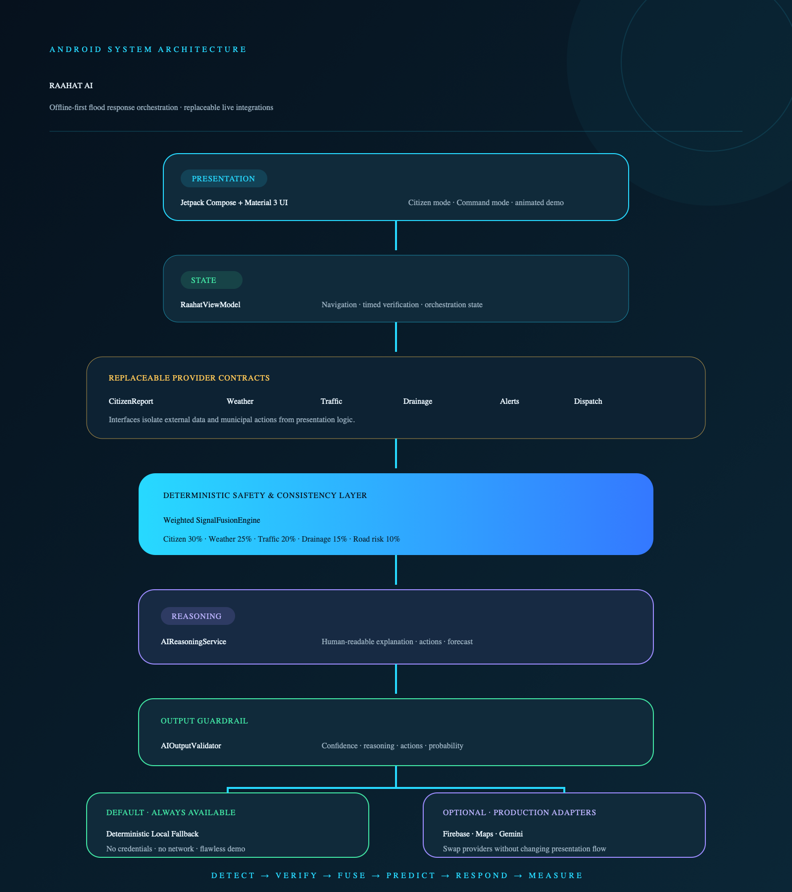

<div align="center">

# RAAHAT AI

### Urban Flood Response Intelligence

**See the flood before it spreads.**

[](https://developer.android.com/)
[](https://kotlinlang.org/)
[](https://developer.android.com/compose)
[](#license)
[](backend/README.md)

An AI-powered urban flood response orchestration platform built for the **Sabz Pakistan / Nikaas** problem statement.

</div>

---

## The idea

Traditional systems tell authorities where flooding has already happened. **RAAHAT AI predicts where the danger is going, compares response strategies, coordinates the selected response, and measures whether it worked.**

The experience is designed as an emergency command system—not a conventional complaint application:

> **Detect → Verify → Fuse → Predict → Decide → Simulate → Respond → Measure**

## Architecture



- **Jetpack Compose + Material 3** provide the premium dark command-center interface.
- **`RaahatViewModel`** owns navigation, timed verification, and deterministic demo state.
- **Provider interfaces** isolate citizen reports, weather, traffic, drainage, alerts, and dispatch.
- **`SignalFusionEngine`** remains the deterministic safety and consistency layer.
- **`AIReasoningService`** supports Gemini-generated explanations with a reliable local fallback.
- **`AIOutputValidator`** validates confidence, reasoning, actions, and forecast probability.
- **RAAHAT API** provides report ingestion, incident state, deterministic analysis, and response execution.
- Firebase, Google Maps, and Gemini implementations can replace mock providers without changing the presentation flow.

The editable Canva-compatible version is available at [`outputs/raahat-code-architecture-canva.svg`](outputs/raahat-code-architecture-canva.svg).

## Key experiences

### Citizen mode

- Live neighborhood risk summary
- Fast flood reporting with simulated location detection
- Water-level and situation classification
- Optional photo-evidence flow
- Animated multi-signal AI verification
- Confidence score and human-readable escalation explanation

### Emergency Command mode

- Real-time city KPIs and priority incidents
- Interactive simulated Islamabad flood-risk map
- Animated severity meters and incident details
- Flood Path Forecast for secondary-risk zones
- Response strategy comparison and AI recommendation
- Timed response orchestration
- Traffic rerouting, dispatch ticket, and resident-alert simulation
- Before/after Digital Twin impact measurement
- City Pulse resilience ranking
- RAAHAT Copilot with contextual command responses

## Signal fusion model

RAAHAT never evaluates an incident from citizen reports alone. Five independent signals contribute to a deterministic score:

| Signal | Weight | Example evidence |
|---|---:|---|
| Citizen reports | 30% | Report count, photo, vehicle/person risk |
| Weather | 25% | Rainfall intensity in mm/hr |
| Traffic | 20% | Congestion and speed reduction |
| Drainage | 15% | Simulated capacity and blockage |
| Road vulnerability | 10% | Underpasses and low-lying roads |

Severity thresholds:

| Score | Severity |
|---:|---|
| 0–29 | Low |
| 30–49 | Moderate |
| 50–69 | High |
| 70–84 | Severe |
| 85–100 | Critical |

AI confidence is calculated separately and increases when independent signals agree. Gemini may generate the explanation, but the deterministic score remains the underlying safety layer.

## Demo scenario

The built-in scenario runs without credentials or network access:

1. Rainfall increases from 12 to 36 mm/hr.
2. Traffic congestion rises around G-10 Underpass.
3. Citizen reports begin clustering.
4. Severity progresses from low to critical.
5. AI confidence rises to 94%.
6. Three response strategies are compared.
7. Strategy B is recommended as the best balance of speed, cost, and protection.
8. The underpass closes, traffic reroutes, D-07 is dispatched, and 1,240 residents are warned.
9. The Digital Twin displays measurable before/after impact.

## Technology

- Kotlin
- Jetpack Compose
- Material 3
- Android ViewModel
- Kotlin coroutines
- Deterministic mock repositories and services
- Custom Compose Canvas maps and visualizations
- Gradle wrapper for reproducible builds
- Zero-dependency Node.js REST backend with built-in tests

## Project structure

```text
app/src/main/java/pk/raahat/ai/
├── MainActivity.kt       # Compose screens, visual system and navigation shell
├── RaahatViewModel.kt    # App state, demo timing and interactions
├── Models.kt             # Domain models and SignalFusionEngine
└── Services.kt           # Provider interfaces, planners, validator and AI fallback

outputs/
├── raahat-code-architecture-canva.svg
└── raahat-code-architecture-preview.png

backend/
├── server.mjs            # REST API and deterministic scoring
├── test/api.test.mjs     # Health, ingestion, scoring and dispatch tests
└── package.json          # Zero-dependency Node scripts
```

## Getting started

### Requirements

- Android Studio with Android SDK 36
- JDK supported by Android Studio
- Android device or emulator running API 26+

### Build

```bash
git clone https://github.com/HamzaAfzal5054/RAAHAT-AI.git
cd RAAHAT-AI
./gradlew :app:assembleDebug
```

The generated APK is written to:

```text
app/build/outputs/apk/debug/app-debug.apk
```

### Install on a connected device

```bash
./gradlew :app:installDebug
```

Launch **RAAHAT AI**, then choose **Launch Demo Scenario** for the complete presentation flow.

### Run the backend

```bash
cd backend
npm test
npm start
```

The API runs at `http://localhost:8080`. The Android emulator automatically checks `http://10.0.2.2:8080` and displays **BACKEND LIVE** when available. If the API is unavailable, the app remains fully functional in **OFFLINE SAFE** mode.

See the [backend API documentation](backend/README.md) for available routes.

### Open in Antigravity

Open `RAAHAT-AI.code-workspace` in Antigravity. The repository includes optimized file exclusions and ready-made tasks for:

- Building the Android APK
- Installing on an emulator
- Starting the backend
- Running backend tests

Use the command palette and select **Tasks: Run Task** to launch any workflow.

## Live integration roadmap

The current implementation intentionally favors a flawless offline demonstration. Production providers can be added for:

- Firebase Authentication, Firestore, and Storage
- Google Maps Compose and live traffic overlays
- Weather and rainfall APIs
- Municipal drainage telemetry
- Gemini structured reasoning responses
- SMS, push notification, and municipal dispatch systems

## Design principles

- Never present RAAHAT as merely a flood complaint system.
- Always expose the independent signals behind an escalation.
- Keep deterministic scoring beneath generative explanations.
- Show predicted spread and response trade-offs before execution.
- Measure operational impact after every simulated response.

## License

This repository is provided as a hackathon and demonstration project. Review licensing and security requirements before production deployment.

---

<div align="center">

**RAAHAT AI — predict danger, coordinate action, measure impact.**

</div>
